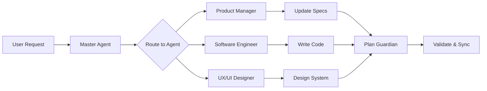

# Getting Started

This guide walks you through setting up and using the Agent Council for your own projects.

## Prerequisites

- **Git** for version control
- **IDE with AI Assistant** (e.g., Cursor, VS Code with Copilot, or any AI coding tool)
- Basic familiarity with Markdown

## Quick Start (5 minutes)

### 1. Fork or Clone the Repository

```bash
# Option A: Fork on GitHub, then clone your fork
git clone https://github.com/YOUR_USERNAME/my-agent-council.git

# Option B: Clone directly and set your own remote
git clone https://github.com/ppablobr/my-agent-council.git my-project
cd my-project
git remote set-url origin https://github.com/YOUR_USERNAME/your-repo.git
```

### 2. Understand the Structure

```
├── AGENTS.md                 # Agent roles and responsibilities
├── AGENT_MASTER.md           # Master agent orchestration
├── BACKLOG.md                # Prioritized work items
├── DECISIONS.md              # Decision log
├── PLAN.md                   # Project execution plan
├── ROADMAP.md                # Milestones
├── RISKS.md                  # Risk register
│
├── product_manager/          # PM specs (PRD, governance, rules)
├── software_engineer/        # Eng specs (coding, database, stack)
├── ux_ui_designer/           # UX/UI specs (design system, flows)
├── github_agent/             # GitHub automation
├── plan_guardian/            # Plan maintenance
│
├── docs/adr/                 # Architecture Decision Records
├── scripts/                  # Guardrails and automation
└── app/                      # Your application code
```

### 3. Configure Your Project

1. **Edit `product_manager/PRD.md`** — Define your product vision, users, and goals.

2. **Update `software_engineer/TECH_STACK.md`** — Set your technology choices.

3. **Customize `ux_ui_designer/DESIGN_SYSTEM.md`** — Define your design tokens.

### 4. Start Your First Task

1. Add a work item to `BACKLOG.md`:

```markdown
| BL-004 | Feature | User authentication | Ready | M1 | Eng | - |
```

2. Ask your AI assistant:

> "Act as the Software Engineer agent. Implement BL-004 (User authentication) following the specs in `software_engineer/` and update the plan when done."

3. The AI will:
   - Read the relevant specs
   - Implement the feature in `app/`
   - Update `PLAN.md` and `BACKLOG.md`

## Workflow Overview



## Next Steps

- Read the full [Usage Guide](./USAGE.md) for detailed workflows
- See [Customization Guide](./CUSTOMIZATION.md) to adapt the council to your needs
- Check [ADR Process](./adr/README.md) for recording technical decisions
