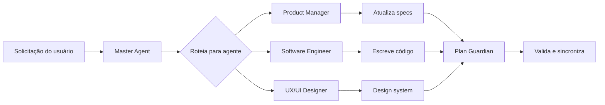

# Primeiros passos

Este guia mostra como configurar e usar o Agent Council nos seus próprios projetos.

## Pré-requisitos

- **Git** para controle de versão
- **IDE com assistente de IA** (ex.: Cursor, VS Code com Copilot ou qualquer ferramenta de IA para programar)
- Familiaridade básica com Markdown

## Começando rápido (5 minutos)

### 1. Faça fork ou clone do repositório

```bash
# Opção A: faça fork no GitHub e depois clone o seu fork
git clone https://github.com/YOUR_USERNAME/my-agent-council.git

# Opção B: clone diretamente e configure o seu remote
git clone https://github.com/ppablobr/my-agent-council.git my-project
cd my-project
git remote set-url origin https://github.com/YOUR_USERNAME/your-repo.git
```

### 2. Entenda a estrutura

```
├── AGENTS.md                 # Papéis e responsabilidades dos agentes
├── AGENT_MASTER.md           # Orquestração do Master Agent
├── BACKLOG.md                # Itens de trabalho priorizados
├── DECISIONS.md              # Log de decisões
├── PLAN.md                   # Plano de execução do projeto
├── ROADMAP.md                # Marcos (milestones)
├── RISKS.md                  # Registro de riscos
│
├── product_manager/          # Specs do PM (PRD, governança, regras)
├── software_engineer/        # Specs de Eng (código, banco, stack)
├── ux_ui_designer/           # Specs de UX/UI (design system, fluxos)
├── github_agent/             # Automação no GitHub
├── plan_guardian/            # Manutenção do plano
│
├── docs/adr/                 # Registros de Decisão de Arquitetura (ADRs)
├── scripts/                  # Guardrails e automação
└── app/                      # Código da sua aplicação
```

### 3. Configure o seu projeto

1. **Edite `product_manager/PRD.md`** — defina a visão do produto, usuários e objetivos.

2. **Atualize `software_engineer/TECH_STACK.md`** — defina as escolhas de tecnologia.

3. **Personalize `ux_ui_designer/DESIGN_SYSTEM.md`** — defina seus tokens de design.

### 4. Configure servidores MCP (opcional)

Se você quiser habilitar integrações de IA, como operações automatizadas no GitHub, configure os servidores MCP (Model Context Protocol):

1. Copie a configuração de exemplo:

```bash
cp mcp.json.example mcp.json
```

2. Edite `mcp.json` e adicione suas credenciais:

```json
{
  "mcpServers": {
    "github": {
      "command": "npx",
      "args": ["-y", "@modelcontextprotocol/server-github"],
      "env": {
        "GITHUB_PERSONAL_ACCESS_TOKEN": "seu_token_real_aqui"
      }
    }
  }
}
```

> [!IMPORTANT]
> Nunca faça commit de `mcp.json` no controle de versão — ele contém credenciais sensíveis. O arquivo `.gitignore` já inclui esse arquivo.

### 5. Comece sua primeira tarefa

1. Adicione um item de trabalho em `BACKLOG.md`:

```markdown
| BL-004 | Feature | User authentication | Ready | M1 | Eng | - |
```

2. Peça ao seu assistente de IA:

> "Aja como o agente Software Engineer. Implemente o BL-004 (autenticação de usuário) seguindo as specs em `software_engineer/` e atualize o plano quando terminar."

3. A IA irá:
   - Ler as specs relevantes
   - Implementar a funcionalidade em `app/`
   - Atualizar `PLAN.md` e `BACKLOG.md`

## Visão geral do workflow



## Próximos passos

- Leia o [Guia de uso](./USAGE.md) para workflows detalhados
- Veja o [Guia de personalização](./CUSTOMIZATION.md) para adaptar o conselho ao seu projeto
- Consulte o [processo de ADR](./adr/README.md) para registrar decisões técnicas
