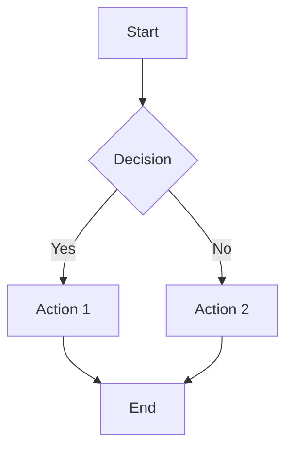

# UX Flow

This document defines user experience flows and journey mapping for the project.

## User Journey Format

Document each major user journey using this template:

```markdown
## [Journey Name]

### Goal
What the user is trying to accomplish.

### Trigger
What initiates this journey (link click, notification, etc.)

### Steps
1. User sees [page/element]
2. User performs [action]
3. System responds with [feedback]
4. ...

### Success Criteria
How do we know the journey succeeded?

### Error Paths
- If [condition], show [error state]
- If [condition], redirect to [fallback]
```

## Flow Diagram Conventions

Use Mermaid diagrams for visualizing flows:



### Node Types

| Shape | Syntax | Usage |
| --- | --- | --- |
| Rectangle | `[text]` | Actions, pages |
| Diamond | `{text}` | Decisions |
| Rounded | `(text)` | Start/End |
| Circle | `((text))` | Connectors |

## Interaction Patterns

### Navigation

| Pattern | Usage | Implementation |
| --- | --- | --- |
| Link | Navigate to new page | `<Link to="/path">` |
| Modal | Contextual action | Open overlay, no URL change |
| Drawer | Secondary content | Slide-in panel |
| Tab | Switch content | URL param or state |

### Feedback

| Event | Feedback | Timing |
| --- | --- | --- |
| Form submit | Loading spinner | Immediate |
| Success | Toast + redirect | After response |
| Error | Inline message | After response |
| Validation | Field-level error | On blur or submit |

### Loading States

1. **Skeleton**: For content that has a predictable shape
2. **Spinner**: For actions with unknown duration
3. **Progress bar**: For uploads or multi-step processes

## Micro-interactions

| Interaction | Animation | Purpose |
| --- | --- | --- |
| Button click | Scale down briefly | Tactile feedback |
| Hover | Color/shadow change | Affordance |
| Modal open | Fade + slide up | Draw attention |
| Toast appear | Slide in from edge | Non-intrusive alert |

---

## User Journeys

> **Note:** Document each major journey below as it is designed.

_No journeys documented yet._
