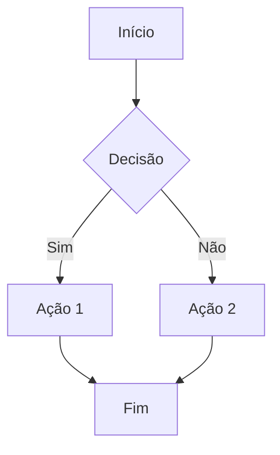

# Fluxos de UX

Este documento define fluxos de experiência do usuário e mapeamento de jornadas para o projeto.

## Formato de jornada do usuário

Documente cada jornada principal usando este template:

```markdown
## [Nome da jornada]

### Goal
O que o usuário está tentando realizar.

### Trigger
O que inicia a jornada (clique em link, notificação etc.).

### Steps
1. Usuário vê [página/elemento]
2. Usuário realiza [ação]
3. Sistema responde com [feedback]
4. ...

### Success Criteria
Como sabemos que a jornada foi bem-sucedida?

### Error Paths
- Se [condição], mostrar [estado de erro]
- Se [condição], redirecionar para [fallback]
```

## Convenções de diagrama de fluxo

Use diagramas Mermaid para visualizar fluxos:



### Tipos de nós

| Forma | Sintaxe | Uso |
| --- | --- | --- |
| Retângulo | `[text]` | Ações, páginas |
| Losango | `{text}` | Decisões |
| Arredondado | `(text)` | Início/Fim |
| Círculo | `((text))` | Conectores |

## Interaction Patterns

### Navigation

| Padrão | Uso | Implementação |
| --- | --- | --- |
| Link | Navegar para nova página | `<Link to="/path">` |
| Modal | Ação contextual | Abrir overlay, sem mudar URL |
| Drawer | Conteúdo secundário | Painel que desliza |
| Aba | Trocar conteúdo | Param na URL ou state |

### Feedback

| Evento | Feedback | Momento |
| --- | --- | --- |
| Envio de formulário | Loading spinner | Imediato |
| Sucesso | Toast + redirect | Após resposta |
| Erro | Mensagem inline | Após resposta |
| Validação | Erro por campo | Ao sair do campo ou ao enviar |

### Loading States

1. **Skeleton**: para conteúdo com forma previsível
2. **Spinner**: para ações com duração desconhecida
3. **Barra de progresso**: para uploads ou processos em múltiplas etapas

## Micro-interactions

| Interação | Animação | Propósito |
| --- | --- | --- |
| Clique no botão | Reduzir escala rapidamente | Feedback tátil |
| Hover | Mudança de cor/sombra | Affordance |
| Abrir modal | Fade + slide up | Chamar atenção |
| Toast aparecer | Entrar pela borda | Alerta não intrusivo |

---

## User Journeys

> **Nota:** documente cada jornada principal abaixo conforme for desenhada.

_No journeys documented yet._
